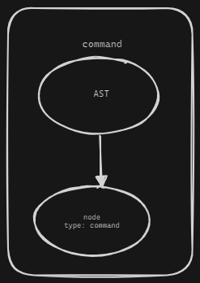
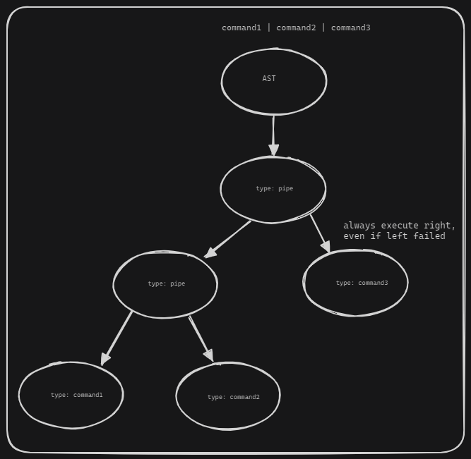
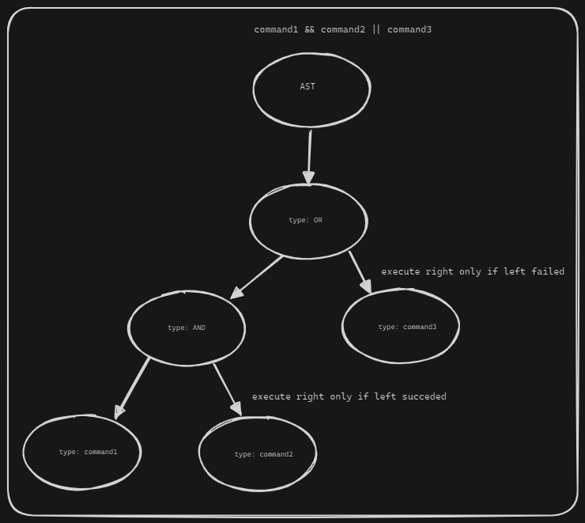
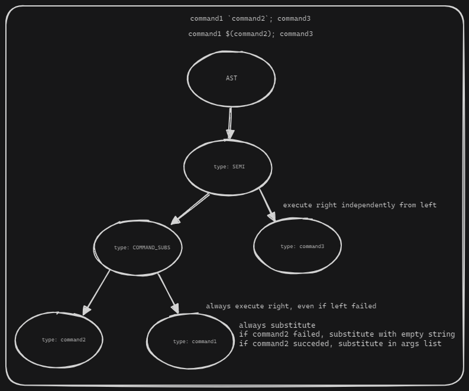
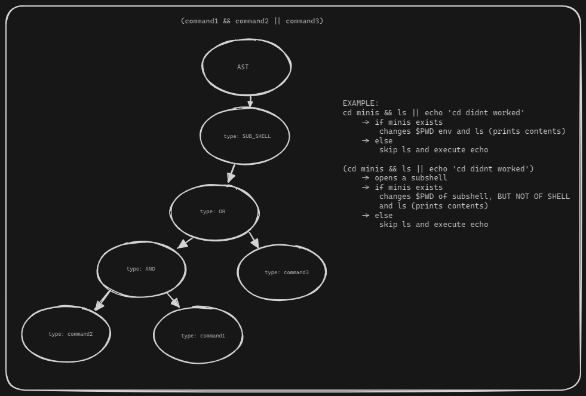
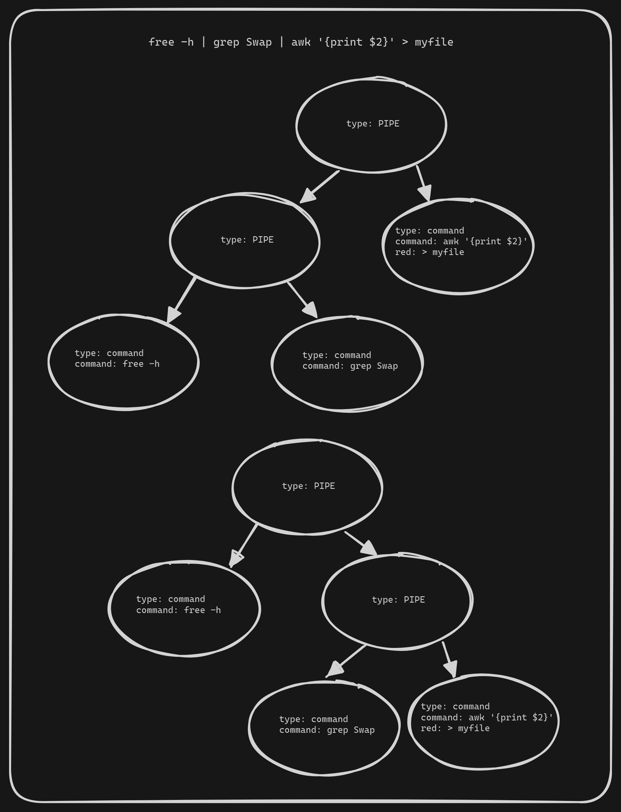
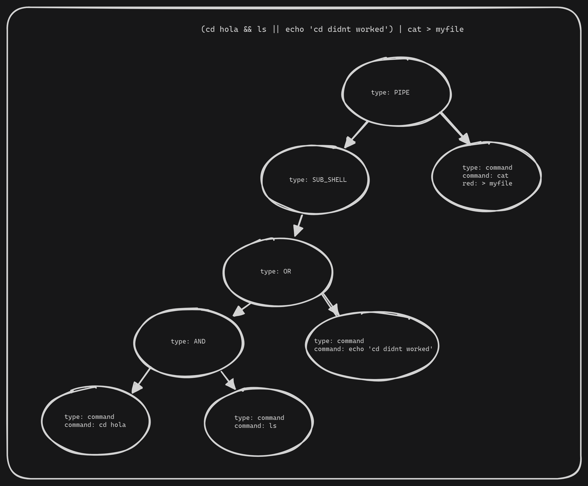
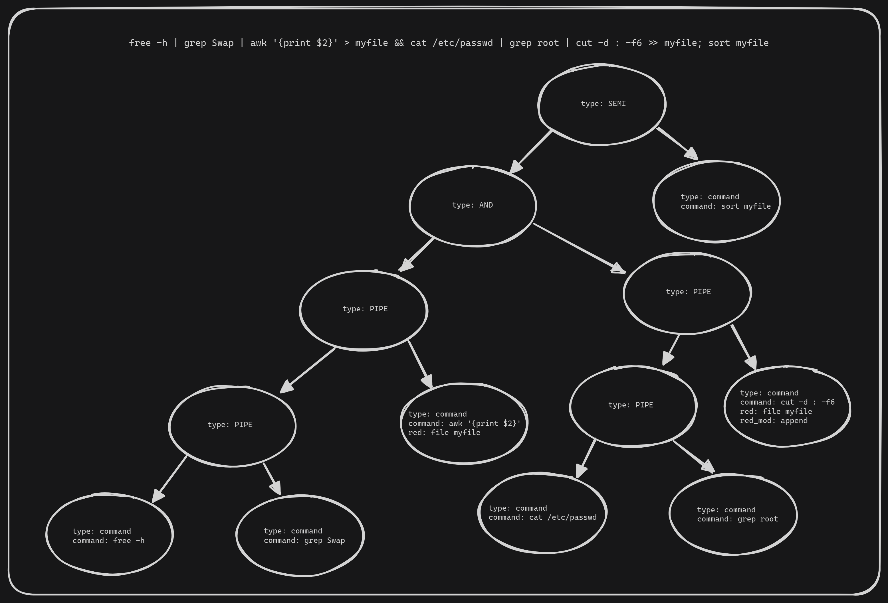

# Executor

The executor is the last step in the shell pipeline. It is responsible for executing the commands that were parsed and expanded by the parser and the expandor, respectively.

## Binary Executor Tree

The executor uses a binary executor tree (ebt) to store the commands to be executed. The ebt is a binary tree where each node is a command to be executed. The tree is built by the parser and expanded by the expandor.

```c
/*
 * Binary Executor Tree
 *		- command: command to be executed (if type is EBT_OP_COMMAND, else NULL)
 *		- type: type of operation
 *		- left: left node
 *		- right: right node
 */
typedef struct s_ebt
{
    t_command		*command;
    t_ebt_op		type;
    struct s_ebt	*left;
    struct s_ebt	*right;
}					t_ebt;

typedef struct s_command
{
	char			*command;
	char			**args;
	char			*heredoc_file_name;
    t_list	        *redirections;
}					t_command;

typedef enum e_red_type
{
    RT_STDIN,
    RT_STDOUT,
    RT_STDERR,
    RT_WRITE,   // has file
    RT_APPEND,  // has file
    RT_READ,    // has file
} t_red_type;

typedef struct s_redirection
{
    t_red_type      from;   // can be RT_STDIN, RT_STDOUT, RT_STDERR, RT_READ
    t_red_type		to;     // can be RT_STDIN, RT_STDOUT, RT_STDERR, RT_WRITE, RT_APPEND
    char			*file_name;
}					t_redirection;
```

## Tree examples
The tree may look like this for each of the following examples:

### Simple command


### Pipe


### Operators


### Substitution and Semicolon


### Subshell


## Trees examples

### Simple command pipeline

Here is shown a pipeline tree. These 2 trees in the image are equivalent semantically.



### Subshell pipeline

In this image is shown a tree with a subshell. For the Subshell, the cd command inside the subshell won't change the current directory of the current shell.
We can achieve that by passing to the built in function a fake copy of the environment variables.
We can create a function (copy_env) that will copy the environment variables and pass it to the built-in function when in a subshell.



### Complex pipeline




The tree in a json format representing the structs would look something like this:

```bash
free -h | grep Swap | awk '{print $2}' > myfile && cat < /etc/passwd 2>>myfile | grep root | cut -d : -f6 >> myfile; sort myfile
```

```javascript
const ebt = {
    command: NULL,
    type: EBT_OP_SEMICOLON,
    left: {
        command: NULL,
        type: EBT_OP_AND,
        left: {
            command: NULL,
            type: EBT_OP_PIPE,
            left: {
                command: NULL,
                type: EBT_OP_PIPE,
                left: {
                    command: {
                        command: "free",
                        args: ["-h"],
                        redirections: NULL
                    },
                    type: EBT_OP_COMMAND,
                    left: NULL,
                    right: NULL
                },
                right: {
                    command: {
                        command: "grep",
                        args: ["Swap"],
                        redirections: NULL
                    },
                    type: EBT_OP_COMMAND,
                    left: NULL,
                    right: NULL
                }
            },
            right: {
                command: {
                    command: "awk",
                    args: ["{print $2}"],
                    redirections: NULL
                },
                type: EBT_OP_COMMAND,
                left: NULL,
                right: NULL
            }
        },
        right: {
            command: NULL,
            type: EBT_OP_PIPE,
            left: {
                command: NULL,
                type: EBT_OP_PIPE,
                left: {
                    command: {
                        command: "cat",
                        args: ["/etc/passwd"],
                        redirections: [
                            { from: RT_READ,   to: RT_STDIN,  file_name: "/etc/passwd" },
                            { from: RT_STDOUT, to: RT_APPEND, file_name: "myfile" },
                        ]
                    },
                    type: EBT_OP_COMMAND,
                    left: NULL,
                    right: NULL
                },
                right: {
                    command: {
                        command: "grep",
                        args: ["root"],
                        redirections: NULL
                    },
                    type: EBT_OP_COMMAND,
                    left: NULL,
                    right: NULL
                }
            },
            right: {
                command: {
                    command: "cut",
                    args: ["-d", ":", "-f6"],
                    redirections: [
                        { from: RT_STDOUT, to: RT_APPEND, file_name: "myfile" },
                    ]
                },
                type: EBT_OP_COMMAND,
                left: NULL,
                right: NULL
            }
        },
    },
    right: {
        command: {
            command: "sort",
            args: ["myfile"],
            redirections: NULL
        },
        type: EBT_OP_COMMAND,
        left: NULL,
        right: NULL
    }
}
```
